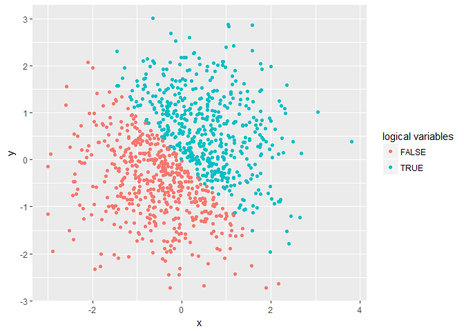
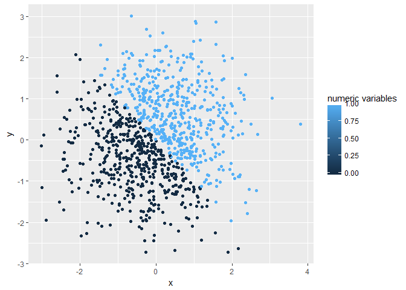
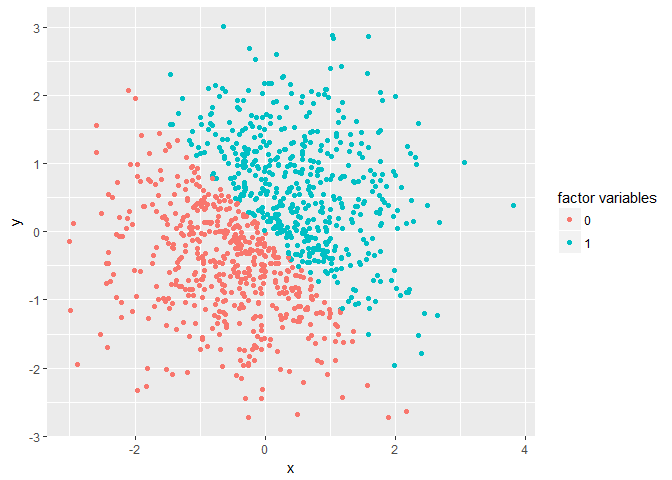

P8105 Homework 1
================
Yuelin Long yl3181
September 14, 2018

Problem 1
=========

Create and take the column means of a data frame comprised of:

-   A random sample of size 10 from a uniform\[0, 5\] distribution
-   A logical vector indicating whether elements of the sample are greater than 2
-   A (length-10) character vector
-   A (length-10) factor vector

``` r
library(tidyverse)
```

    ## -- Attaching packages ------------------------------------------------------- tidyverse 1.2.1 --

    ## v ggplot2 2.2.1     v purrr   0.2.4
    ## v tibble  1.4.2     v dplyr   0.7.6
    ## v tidyr   0.8.0     v stringr 1.3.0
    ## v readr   1.1.1     v forcats 0.3.0

    ## -- Conflicts ---------------------------------------------------------- tidyverse_conflicts() --
    ## x dplyr::filter() masks stats::filter()
    ## x dplyr::lag()    masks stats::lag()

``` r
set.seed(1)
first_data = tibble(
random_sample = runif(10,0,5),
logic_random_sample = random_sample > 2,
char_vec = unlist(strsplit("mynameisYL","")),
fac_char_vec = factor(char_vec)
)

sapply(first_data,mean)
```

    ##       random_sample logic_random_sample            char_vec 
    ##            2.757569            0.600000                  NA 
    ##        fac_char_vec 
    ##                  NA

``` r
num_logic_random_sample = as.numeric(logic_random_sample)
num_char_vec = as.numeric(char_vec)
num_fac_char_vec = as.numeric(fac_char_vec)
```

For format changes, as.numeric() works for logical vectors and factor vectors, but won't work for character vector.

``` r
mult_change_char_vec = as.numeric(as.factor(char_vec))
mult_change_fac_char_vec = as.numeric(as.character(fac_char_vec))
```

For multiple format changes, if a vector has been converted to factor(numeric) before, all types vectors can be changed to numeric.

Note: In my dataframe, factor vector is numeric. If character factor vector is used, it won't be converted to numeric.

Problem 2
=========

Create a data frame comprised of:

-   x: a random sample of size 1000 from a standard Normal distribution
-   y: a random sample of size 1000 from a standard Normal distribution
-   A logical vector indicating whether the x + y &gt; 0
-   A numeric vector created by coercing the above logical vector
-   A factor vector created by coercing the above logical vector

``` r
set.seed(1)
x = rnorm(1000)

set.seed(2)
y = rnorm(1000)

logi_xy = (x + y > 0)
num_logi_xy = as.numeric(logi_xy)
fac_num_logi = as.factor(num_logi_xy)

second_data = tibble (x, y , logi_xy , num_logi_xy , fac_num_logi)
```

Dataframe Description:

-   Size of the dataset is: 1000, 5
-   x statistics: Mean of x is -0.0116481, while median of x is -0.0353242
-   The proportion of "true" cases in logical vector is 0.506

``` r
library(ggplot2)
ggplot(second_data, aes(x = x, y = y, color = logi_xy)) + geom_point() + labs(color = "numeric variables")  
```



``` r
ggsave("x-y scatter plot with logi color.png")
```

    ## Saving 7 x 5 in image

``` r
ggplot(second_data, aes(x = x, y = y, color = num_logi_xy)) + geom_point() + labs(color = "numeric variables")  
```



``` r
ggplot(second_data, aes(x = x, y = y, color = fac_num_logi)) + geom_point() + labs(color = "factor variables") 
```


